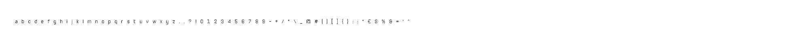

# pixel_caster

[](https://crates.io/crates/pixel_caster)

Get from, and send to, the screen BGRA values in bytes (either 8 or 32 bit unsigned integers, u8/u32) to read or manipulate pixels.

Import/export characters from/to .png files, alterate their color and transparency, create strings out of them and print them on the screen.

## Examples

Many examples can be found in the examples directory. Use the following command, followed by the file title, to compile and run :

``` powershell
cargo run --example
```

## Get bytes

Example for "\examples\get_pixels_bytes.rs" :

``` powershell
cargo run --example get_pixels_bytes
```

The get_bytes example will return a Vec containing the bytes red from the pixels of a screen area of the requested size, starting from an absolute position on the screen.


## Send bytes

Example for "\examples\send_bytes_to_pixels.rs" :

``` powershell
cargo run --example send_bytes_to_pixels
```

The send_bytes_bgra example will send a Vec, either of u8 or u32 values, containing the bytes to be applied to the pixels of a screen area of the requested size, starting from an absolute position on the screen. The Alpha value (Blue Green Red Alpha), which represents the transparency of the resulting color (from the combination of the B G R values) is supported, an Alpha value for every BGR value in the Vec, that overrides their own Alpha value can also be set, in order to change the opacity of every BGR to be sent to the screen. In this example the Vec will contain 64 bytes representing a cube of 4 x 4 (16) pixels, where the first 2 will be red, the other 14 blue (for this example in the Vec each Alpha value has been set to 255, for max opacity) :


There are also provided other functions, such as one that automatically maxes out the Alpha value of every BGRA to be sent to screen, to maximise opacity, and another that sets the Alpha of an RGB combination to 0 so that, for example, when a white (obtained by R: 255, G: 255, B: 255) is being sent to the screen, it becomes completely transparent.

## Clone pixels

Example for "\examples\clone_pixels_on_screen.rs" :

``` powershell
cargo run --example clone_pixels_on_screen
```

The copy_and_paste_pixels example will copy the pixels from a given area of the screen and paste them into another given area of the screen :


## Extract chars' color bytes from a .png file containing sample chars and create strings
### The feature "pixels_string" is required and it's enabled by default

Example for "\examples\text_from_png_chars_sample_to_screen.rs" :

``` powershell
cargo run --example text_from_png_chars_sample_to_screen
```

The cargo run --example text_from_png_chars_sample_to_screen example will import the characters from 2 .png files (that differ in characters size and color) and print on the screen a string made of some of those characters, then will export them one-by-one into a folder, using the .png file format, finally will import them back, create a new string and print it on the screen.





Works only on Windows OS, starting from Windows 2000


## License

- [MIT license](http://opensource.org/licenses/MIT)